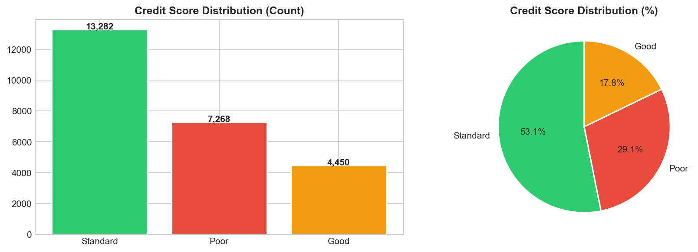
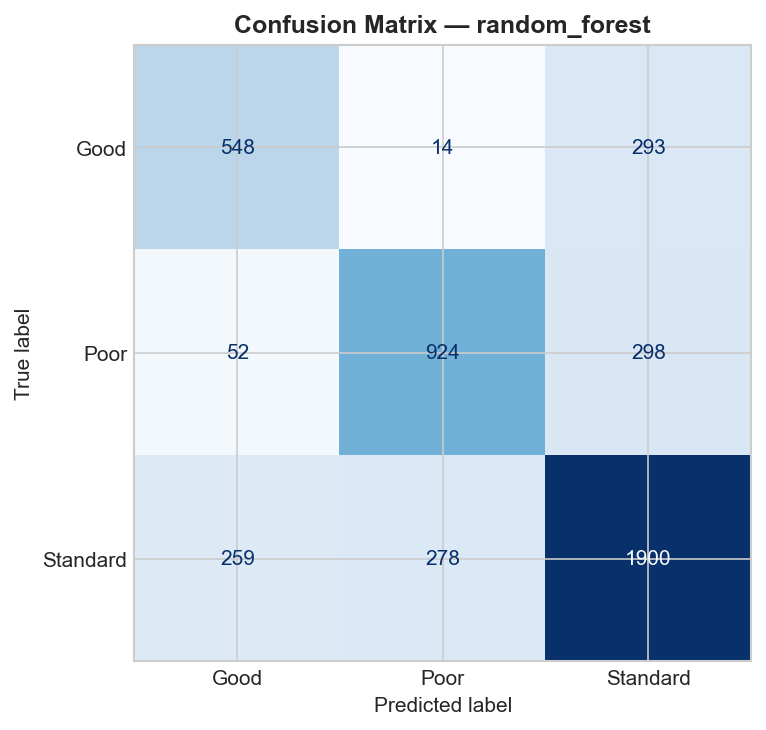
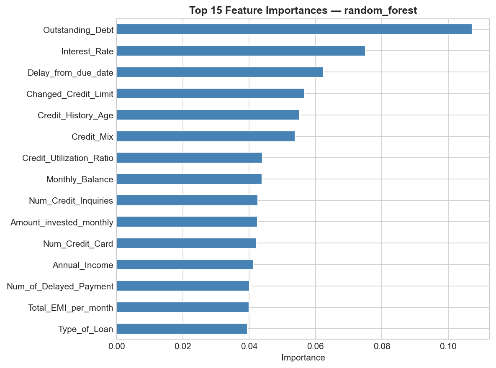

# Credit Score Prediction

A machine learning application for predicting customer **credit score** — **Good**, **Standard**, or **Poor** — based on historical financial data (income, payment history, loan count, credit utilization, and other behavioral indicators).

This project covers the end-to-end ML lifecycle: exploratory data analysis, model training pipeline, and deployment.

---

## Features

- **EDA and Modelling** — full exploratory analysis and 5 model experiments (`notebooks/01_eda_modelling.ipynb`)
- **OOP Pipeline** — `Preprocessor`, `BaseTrainer` (with 5 model subclasses), and `Evaluator` classes with MLflow experiment tracking (`src/pipeline/pipeline.py`)
- **Cloud Pipeline** — training and deployment via AWS SageMaker (`src/pipeline/aws_pipeline.py`)
- **Web Application** — interactive prediction interface built with Streamlit, supporting both single and batch (CSV) predictions (`app_streamlit.py`)
- **REST API** — inference backend built with FastAPI (`api/main.py`), consumed by `app_frontend.py`

---
Live Demo : https://credit-score-prediction-my.streamlit.app/
---
## Preview

| Target Distribution | Confusion Matrix | Feature Importance |
|---|---|---|
|  |  |  |

---

## Project Structure

```
credit_project/
├── app_streamlit.py              # Streamlit app (direct model inference)
├── app_frontend.py               # Streamlit app (via FastAPI backend)
├── run_pipeline.py               # Training entrypoint
├── requirements.txt
├── api/
│   └── main.py                   # FastAPI backend
├── src/pipeline/
│   ├── pipeline.py               # Local OOP pipeline with MLflow tracking
│   └── aws_pipeline.py           # AWS SageMaker cloud pipeline
├── notebooks/
│   └── 01_eda_modelling.ipynb    # EDA and model experimentation
├── models/                       # best_model.pkl and preprocessor.pkl (see download instructions below)
├── data/                         # C.csv (see download instructions below)
├── outputs/                      # EDA and model evaluation visualizations
└── local_vs_cloud_comparison.md  # Comparison between local and cloud pipeline
```

---

## Dataset and Trained Model

The dataset and model artifacts (`.pkl` files) are not included directly in this repository due to file size constraints.

| File | Link |
|---|---|
| `data/C.csv` | https://drive.google.com/file/d/1x1dKmTit4f0oJ2Pivpy8BupVh-AtoYD5/view?usp=sharing |
| `models/best_model.pkl` | https://drive.google.com/file/d/1kErd13_BHMg0gE9b7IQOnkiFLwJbBd0L/view?usp=sharing |
| `models/preprocessor.pkl` | https://drive.google.com/file/d/1Ae6ZpjwIhV4iRpT56rDFDGWaXh_LjD0d/view?usp=sharing |

After downloading, place each file according to the folder structure above. Alternatively, retrain from scratch:

```bash
python run_pipeline.py
```

---

## Getting Started

### 1. Install dependencies
```bash
pip install -r requirements.txt
```

### 2. Prepare dataset and model
Download the files listed above, or retrain using `python run_pipeline.py`.

### 3. Run the Streamlit app
```bash
streamlit run app_streamlit.py
```
Open `http://localhost:8501`

### 4. (Optional) Run via FastAPI
```bash
uvicorn api.main:app --reload      # terminal 1 -> http://localhost:8000/docs
streamlit run app_frontend.py      # terminal 2 -> http://localhost:8501
```

---

## Model Results

| Model | Accuracy | F1 Weighted |
|---|---|---|
| Random Forest (best) | 0.72 | 0.72 |
| Gradient Boosting | 0.71 | 0.71 |
| Decision Tree | 0.68 | 0.68 |
| AdaBoost | 0.63 | 0.60 |
| Logistic Regression | 0.60 | 0.59 |

The best model was selected based on weighted F1 score to account for class imbalance across credit score categories.

---

## Tech Stack

Python, scikit-learn, MLflow, Streamlit, FastAPI, AWS SageMaker, pandas, seaborn

---

## Author

**Michael Yeremia**
https://www.linkedin.com/in/michael-yeremia-3721a0360/ · https://github.com/jeraamii
